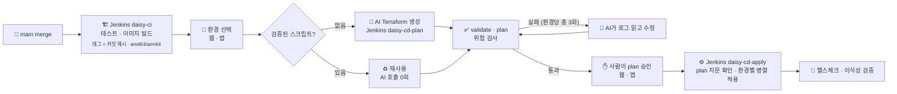

# Unibloom

### 한 번 정의하고, 어디서든 피우다
**One Action, Infinite Clouds**

AI 기반 온프레미스 · 퍼블릭 클라우드 원터치 배포 시스템

 

Team Daisy · SoftBank Hackathon 2026 in Korea 예선 (Term 1) · 🇯🇵 日本語はページ下部の「日本語」を開いてください

---

## 🌱 무엇을 만드나요

배포할 환경만 고르면, **AI가 환경마다 인프라 코드(Terraform)를 만들고 검증해서** 같은 애플리케이션을 **온프레미스 · AWS · Azure · GCP에 동시에** 올려요.

핵심 키워드는 **이식성**이에요. 한 번 빌드한 **같은 이미지**를 모든 환경에 **같은 상태**로 배포하고, 배포가 끝나면 환경마다 이미지 digest · 커밋 · 헬스체크를 비교해서 정말 같은지 보여줘요.

  
   배포 결과 화면 — AWS · Azure · GCP · 온프레미스 4곳이 같은 이미지 digest로 떠 있는지 한 표로 비교해요

## 🤔 왜 필요한가요

한 서비스를 여러 환경에 두어야 하는 이유는 분명한데, 환경마다 명령어 · 구성 방식 · 제약이 달라서 실제로 옮기기는 어려워요.

| | 이유 | 예시 |
|---|---|---|
| 🏛️ | **규제와 보안** | 금융 · 공공처럼 민감한 데이터는 사내 서버에 두고, 외부 서비스는 클라우드에서 운영해야 해요 |
| 🔥 | **장애 대비** | 2022년 판교 데이터센터 화재로 카카오 서비스가 오래 멈췄던 것처럼, 한 곳에만 기대면 그곳의 장애가 곧 서비스 전체의 장애가 돼요 |
| 💸 | **비용과 종속 회피** | 한 클라우드에 묶이면 가격 정책이 바뀌어도 옮기기 어려워요. 환경을 고를 수 있어야 협상력도 생겨요 |

Unibloom의 목표는 **사용자가 환경마다의 차이를 깊이 몰라도, 원하는 환경을 고르는 것만으로** 여러 곳에 같은 서비스를 배포하게 하는 거예요.

## 👥 누가 쓰나요

<table>
<tr>
<td width="50%" valign="top">

### 🏢 온프레미스와 클라우드를 함께 쓰는 기업
규제 때문에 사내 서버를 유지하면서, 대외 서비스는 클라우드에도 올려야 하는 금융 · 공공 · 제조 기업

</td>
<td width="50%" valign="top">

### 🧑‍💻 전담 인프라 인력이 부족한 팀
개발자가 인프라까지 맡아야 하는 스타트업 · 작은 개발팀

</td>
</tr>
<tr>
<td valign="top">

### 📦 고객마다 다른 환경에 납품하는 회사
A 고객사는 AWS, B 고객사는 사내 서버를 요구할 때 같은 앱을 각 고객 환경에 올려야 하는 SI · 솔루션 기업

</td>
<td valign="top">

### 🔄 클라우드 이전 · 추가를 검토하는 기업
비용이나 성능을 비교하려고 다른 환경에도 같은 서비스를 띄워 보고 싶은 곳

</td>
</tr>
</table>

## 📊 시장 조사

> 출처: [Flexera 2026 State of the Cloud Report](https://www.flexera.com/blog/finops/flexera-2026-state-of-the-cloud-report-the-convergence-of-cloud-and-value/) (2026-03, 753개 조직 · 대기업 620 / 중소 133). 차트는 CC BY 4.0에 따라 출처를 밝히고 그대로 실었어요.

<table>
<tr>
<td width="50%" valign="top">

**클라우드를 하나만 쓰는 곳은 11%** — 하이브리드(퍼블릭 + 프라이빗)가 73%예요.
</td>
<td width="50%" valign="top">

**43%가 앱 · 컨테이너를 클라우드 사이에서 옮겨 써요** — Unibloom은 같은 컨테이너 이미지를 4개 환경에 한 번에 배포해요.
</td>
</tr>
<tr>
<td valign="top">

**클라우드 워크로드의 23%를 다시 가져왔어요** (전년 대비 +2%p) — 그래서 온프레미스를 기본 환경으로 두었어요.
</td>
<td valign="top">

**인력 · 전문성 부족 73%, 멀티클라우드 관리 73%** — 환경별 인프라 코드는 AI가 만들고, 사람은 plan을 보고 승인만 해요.
</td>
</tr>
</table>

- 옮길 때 가장 어려운 일은 **앱 의존성 파악(54%)** 과 **기술적 가능성 판단(44%)** 이에요. Unibloom은 `deploy.yaml` 하나로 포트 · 헬스체크 · 환경변수 · DB를 읽어 환경별 코드로 바꿔요.
- AI 워크로드를 키울 때 1순위 걱정은 **보안 · 규정 준수(53%)** 예요. 그래서 AI가 만든 코드는 바로 적용하지 않고 **위험 검사 → plan → 사람 승인 → 결과 대조**를 거쳐요.

### 기존 서비스와 비교

| 서비스 | 특징 | Unibloom과 다른 점 |
|---|---|---|
| HCP Terraform | plan 후 승인해서 apply, 정책 검사 · 비용 추정 | 인프라 코드가 이미 있는 팀용 |
| Atlantis | 오픈소스, Pull Request로 plan / apply | 인프라 코드가 이미 있는 팀용 |
| Spacelift | 여러 IaC 지원, OPA 정책, AI 어시스턴트 | 플랫폼 팀용 |
| env zero | 정책 · 비용 한도 · 드리프트 감지, AI 에이전트 | 플랫폼 팀용 |
| Pulumi Neo | 자연어로 인프라 코드 생성, 사람 승인 후 배포 | 온프레미스 · 여러 환경 동시 배포는 확인하지 못했어요 |

> Unibloom은 **인프라 코드가 없는 앱 개발자가 한 번의 요청으로 클라우드와 온프레미스에 같은 앱을 올리는 흐름**에 집중했어요. AI로 인프라 코드를 만드는 것 자체는 다른 서비스도 하고 있어서 차별점으로 보지 않아요.

## ✨ 주요 기능

<table>
<tr>
<td width="33%" valign="top">

### 🚀 원터치 멀티 배포
온프레미스 · AWS · Azure · GCP 중 여러 곳을 한 번에 골라 **병렬로** 배포해요. 환경마다 Terraform state와 잠금은 따로예요.

</td>
<td width="33%" valign="top">

### 🤖 AI가 쓰고, AI가 고쳐요
Claude가 `deploy.yaml`과 환경별 기준 모듈로 Terraform을 만들어요. validate · plan · 위험 검사에 실패하면 **로그를 읽고 스스로 고쳐요** (환경당 총 3회).

</td>
<td width="33%" valign="top">

### ♻️ 검증된 스크립트 재사용
입력 지문(설정 · 기준 모듈 · 규칙)이 같으면 **AI를 부르지 않고** 검증된 스크립트로 이미지 태그만 바꿔요. AI 호출 0회 · 비용 0원.

</td>
</tr>
<tr>
<td valign="top">

### ✋ 모든 변경은 사람이 승인
plan의 생성 · 변경 · 삭제와 위험 설정, AI 비용을 보여주고 **사람이 승인해야만** 적용해요. 삭제가 있으면 프로젝트 이름까지 입력해요.

</td>
<td valign="top">

### 🧩 한 곳이 실패해도 나머지는 계속
한 환경이 3회 모두 실패해도 다른 환경은 그대로 진행해요. 실패한 환경만 골라 **같은 빌드로 다시 시도**할 수 있어요.

</td>
<td valign="top">

### ⏪ 롤백도 새 배포
이전 성공 커밋과 그때 검증된 스크립트로 **새 배포를 만들고**, 똑같이 plan 승인을 거쳐요. 환경을 골라 되돌릴 수 있어요.

</td>
</tr>
<tr>
<td valign="top">

### ⚡ 실시간 진행
SSE로 단계 · 상태 · 로그가 실시간으로 흘러요. 끊기면 마지막 위치(`Last-Event-ID`)부터 다시 이어 받아요.

</td>
<td valign="top">

### 🔍 이식성 검증
이미지는 커밋 해시 태그로 **한 번만** 만들고(amd64 · arm64 멀티 아키텍처), 배포 뒤 환경별 **digest · 커밋 · 헬스체크**를 한 표로 비교해요.

</td>
<td valign="top">

### 📱 웹 + 네이티브 앱
웹 대시보드와 **iOS · macOS 앱**이 같은 API로 전체 흐름을 해요. 승인이 필요하면 iPhone으로 알림이 와서 어디서든 승인할 수 있어요.

</td>
</tr>
</table>

## 🖥️ 서비스 화면

> 모두 실서비스([www.unibloom.cloud](https://www.unibloom.cloud))에서 샘플 앱 `sample-monolith`을 4개 환경에 배포하며 찍은 화면이에요.

<table>
<tr>
<td width="50%"> <b>① 환경 선택</b> — 같은 이미지(커밋 해시)를 보낼 환경을 여러 곳 한 번에 골라요</td>
<td width="50%"> <b>② 생성 · 검증</b> — 환경마다 AI 생성 또는 재사용, validate · plan · 위험 검사</td>
</tr>
<tr>
<td> <b>③ 승인</b> — 환경별 리소스 변경 · 위험 설정 · AI 비용을 보고 사람이 승인해요</td>
<td> <b>④ 배포 중</b> — 4개 환경에 병렬 apply, 실시간 로그(SSE)</td>
</tr>
<tr>
<td> <b>개요</b> — 환경별 현재 버전 · 헬스, 지금 할 일, 동일성 검증</td>
<td> <b>환경</b> — 환경별 런타임 · 리전 · 연결 방식 · state 위치</td>
</tr>
<tr>
<td> <b>스크립트</b> — AI가 만들고 검증을 통과한 Terraform, 재사용 이력</td>
<td> <b>AI 사용량</b> — 배포별 AI 호출 · 토큰 · 비용, 재사용한 환경은 0원</td>
</tr>
<tr>
<td colspan="2"> <b>배포 이력</b> — 버전마다 어떤 환경에 무엇을 배포했는지, 승인 대기 커밋은 강조해서 보여줘요</td>
</tr>
</table>

## 📱 iPhone 앱

> 웹과 **같은 API · 같은 흐름 · 같은 문구**로 배포 전체를 해요. 모양은 애플 방식(Liquid Glass)이고, 승인이 필요하거나 배포가 끝나면 푸시 알림이 와요. [TestFlight로 설치](https://testflight.apple.com/join/wF5sjQPG)

<table>
<tr>
<td width="33%" align="center">개요</b> — 4개 환경 현재 버전 · 4/4 일치, 지금 할 일" /> <b>개요</b> — 4개 환경 현재 버전 · 4/4 일치, 지금 할 일</td>
<td width="33%" align="center">환경 선택</b> — 웹과 같은 흐름으로 여러 환경을 한 번에" /> <b>환경 선택</b> — 웹과 같은 흐름으로 여러 환경을 한 번에</td>
<td width="33%" align="center">생성 · 검증</b> — 환경별 AI 생성 · 시도 n/3" /> <b>생성 · 검증</b> — 환경별 AI 생성 · 시도 n/3</td>
</tr>
<tr>
<td width="33%" align="center">승인</b> — 환경별 plan을 보고 그 자리에서 승인" /> <b>승인</b> — 환경별 plan을 보고 그 자리에서 승인</td>
<td width="33%" align="center">결과 + 푸시 알림</b> — 배포가 끝나면 iPhone으로 알려줘요" /> <b>결과 + 푸시 알림</b> — 배포가 끝나면 iPhone으로 알려줘요</td>
<td width="33%" align="center">AI 사용량</b> — 재사용한 환경 69곳 · AI 호출 0회" /> <b>AI 사용량</b> — 재사용한 환경 69곳 · AI 호출 0회</td>
</tr>
</table>

## 💻 macOS 앱

> 같은 SwiftUI 코드로 만든 Mac 앱이에요. 넓은 화면에서는 웹처럼 사이드바로 보이고, 전체 배포 흐름을 그대로 할 수 있어요. [Unibloom.dmg 다운로드](https://github.com/Softbank-Hackathon-2026-Team-Daisy/unibloom/releases/download/mac-latest/Unibloom.dmg) (Developer ID 서명 · Apple 공증)

<table>
<tr>
<td width="50%">개요</b> — 사이드바 · 환경별 현재 버전 · 4/4 일치" /> <b>개요</b> — 사이드바 · 환경별 현재 버전 · 4/4 일치</td>
<td width="50%">환경 선택</b> — 4개 환경을 한 번에" /> <b>환경 선택</b> — 4개 환경을 한 번에</td>
</tr>
<tr>
<td width="50%">생성 · 검증</b> — 환경별 진행 · 재사용은 바로 통과" /> <b>생성 · 검증</b> — 환경별 진행 · 재사용은 바로 통과</td>
<td width="50%">승인</b> — 환경별 plan 확인 후 승인하고 배포" /> <b>승인</b> — 환경별 plan 확인 후 승인하고 배포</td>
</tr>
<tr>
<td width="50%">배포 중</b> — 환경별 validate · plan · risk_check · apply" /> <b>배포 중</b> — 환경별 validate · plan · risk_check · apply</td>
<td width="50%">결과</b> — 환경별 QR · 동일성 검증 digest 4/4 일치" /> <b>결과</b> — 환경별 QR · 동일성 검증 digest 4/4 일치</td>
</tr>
</table>

## 🏛️ 아키텍처

  

- **웹 · 앱은 서버만** 거치고, **인프라를 바꾸는 건 Jenkins**예요. 클라우드 자격증명은 Jenkins에만 있고, 서버 · 웹 · 앱 · AI는 키를 갖지 않아요.
- 서버는 세 가지를 지켜요 — **멱등 키**(여러 번 눌러도 한 번만), **plan 지문 비교**(사람이 본 것과 다르면 실행 안 함), **환경별 락**(같은 환경에 두 배포가 동시에 가지 않음).
- Jenkins는 내부망에 있어서 사설망의 온프레미스에도 바로 붙고, Terraform · AI 호출 · state를 한곳에서 관리해요.

## 🔄 배포 흐름

1. **앱 연결 (한 번)** — 사용자 저장소에 `Dockerfile`과 `deploy.yaml`을 둬요. 입력은 GitHub 저장소예요.
2. **이미지 빌드** — `main`에 머지되면 Jenkins `daisy-ci`가 테스트하고 이미지를 만들어 레지스트리에 올려요. 태그는 항상 **커밋 해시**예요.
3. **환경 선택** — 웹이나 앱에서 온프레미스 · AWS · Azure · GCP 중 여러 곳을 한 번에 골라요.
4. **Terraform 생성** — Jenkins `daisy-cd-plan`에서 Claude가 환경별 Terraform을 만들어요. 검증된 스크립트가 있으면 재사용해요.
5. **검증 · 수정** — `validate → plan → 위험 검사`. 실패하면 AI가 로그를 읽고 고쳐요 (첫 생성 포함 환경당 총 3회).
6. **승인 · 적용** — 사람이 plan을 승인하면 Jenkins `daisy-cd-apply`가 plan 지문을 다시 확인하고 환경별로 병렬 적용한 뒤 헬스체크를 해요.

## 🏆 실제로 해 본 결과

| | 결과 |
|---|---|
| 🌐 **4개 환경 실배포** | 같은 이미지(`2f79cb4`)를 AWS · Azure · GCP · 온프레미스에 배포하고, 4곳 모두 digest · 커밋 · 헬스체크 **4/4 일치** |
| 🤖 **첫 배포 AI 비용** | 4개 환경 첫 배포에 AI 4회 호출, **약 821원** |
| ♻️ **다시 배포할 때** | 같은 조건이면 검증된 스크립트 재사용 — **AI 호출 0회 · 0원** |
| ☁️ **환경 추가** | 대회 기간 중 Azure를 기준 모듈 · 위험 검사 규칙 · 환경 등록값만 더해서 추가 |

## 🧭 설계 원칙

| 원칙 | 내용 |
|---|---|
| 🤖 **AI는 판단이 필요한 곳에만** | AI는 Terraform 생성과 수정만 맡아요. AI가 출력할 수 있는 건 Terraform 파일 3개뿐이고, 앱 코드 · Dockerfile은 입력으로도 넣지 않아요 |
| ✋ **모든 인프라 변경은 사람이 승인** | 승인은 웹 · 앱에서 서버 승인 API 하나로 받아요. AI는 apply하지 않아요 |
| 🧩 **한 환경의 실패가 전체를 멈추지 않음** | 한 환경이 3회 모두 실패해도 나머지 환경은 계속 진행해요 |
| ♻️ **검증된 스크립트 재사용** | 바뀌었는지는 AI가 아니라 **입력 지문 비교**로 판단해요. 같으면 AI 호출 0회 |
| ⏪ **롤백도 새 배포** | 이전 성공 커밋과 그 검증된 스크립트로 새 배포를 만들고, 똑같이 승인을 거쳐요 |
| 🗂️ **환경별 state 분리** | 환경마다 Terraform state와 잠금을 따로 둬요 (S3 · Azure Blob · GCS · Jenkins 러너) |
| 🔁 **두 번 눌러도 한 번** | 배포 · 승인 · 롤백 요청은 `Idempotency-Key`로 한 번만 처리해요 |
| 🙅 **없는 값은 만들지 않음** | 확인하지 못한 토큰 · 비용 · 헬스는 0이 아니라 "—"로 보여줘요 |

## 🔐 신뢰성 · 보안

- **승인한 plan만 적용** — plan을 만들 때 plan 파일의 sha256 지문을 저장하고, 적용 직전에 Jenkins가 다시 계산해 비교해요. 한 바이트라도 다르면 적용하지 않고, 낡은 plan은 다시 만들어 다시 승인받아요.
- **위험 설정 검사** — 예를 들어 80 · 443 외 포트를 외부에 열었는지, 관리자 권한을 줬는지, 코드에 비밀값을 넣었는지 봐요. 걸리면 AI가 그 오류를 보고 다시 고쳐요.
- **State 락** — 같은 Terraform state를 쓰는 배포는 동시에 돌지 않아요. 응답이 유실돼도 같은 apply를 자동으로 다시 실행하지 않아요.
- **실시간 이벤트 저널** — 모든 단계 · 로그를 순번(`seq`)으로 저장해요. SSE가 끊겨도 마지막 순번부터 이어 받아요.
- **권한** — Bearer 토큰 하나로 REST · SSE를 인증해요. 읽기 전용 계정은 조회만 되고, 접근할 수 없는 프로젝트는 존재 여부도 드러내지 않아요(404).
- **비밀값** — 클라우드 자격증명은 Jenkins에만 있어요. 비밀값 · 키 · state 파일은 저장소와 로그에 남기지 않고, Jenkins 화면도 외부에 공개하지 않아요.

## 🧱 한계와 다음 과제

| 지금 | 다음 단계 |
|---|---|
| 컨테이너 하나짜리 단일 앱(모놀리스)까지 지원해요 | 서비스 여러 개(MSA)를 한 번에 배포 |
| 헬스체크가 실패하면 그 환경을 실패로 표시해요 | 헬스체크 실패 시 자동 롤백 |
| DB를 함께 만드는 건 AWS(RDS)만 지원하고, 환경 사이 데이터 이전은 범위 밖이에요 | 환경 간 데이터 동기화 · 마이그레이션 |
| 온프레미스 state는 Jenkins 러너 디스크에 있어요 | 원격 state 백엔드로 이전 |
| 서버와 Jenkins가 Proxmox 한 대에 있어 단일 장애 지점이에요 | 서버 다중화, Unibloom 자신도 Unibloom으로 여러 환경에 배포 |
| apply가 시작된 뒤에는 취소를 막아 두었어요 (인프라가 반쯤 바뀐 채 남지 않게) | 단계별 안전한 중단 지점 설계 |

## 🔗 바로가기

| | 링크 |
|---|---|
| 🌐 **웹 대시보드** | [www.unibloom.cloud](https://www.unibloom.cloud) |
| 📡 **API 문서** | [api.unibloom.cloud — Swagger UI](https://api.unibloom.cloud/swagger-ui.html) · [OpenAPI](https://api.unibloom.cloud/v3/api-docs) |
| 🍎 **macOS 앱** | [Unibloom.dmg 다운로드](https://github.com/Softbank-Hackathon-2026-Team-Daisy/unibloom/releases/download/mac-latest/Unibloom.dmg) (Developer ID 서명 · Apple 공증) |
| 📱 **iPhone 앱** | [TestFlight로 설치](https://testflight.apple.com/join/wF5sjQPG) |

## 📦 Repositories

| 레포 | 설명 |
|---|---|
| [**unibloom**](https://github.com/Softbank-Hackathon-2026-Team-Daisy/unibloom) | 배포 시스템 본체 — 웹 대시보드(`web/`) · Swift 앱(`ios/`) · 배포 서비스(`server/`) · 인프라 · AI 생성(`infra/`) |
| [**sample-monolith**](https://github.com/Softbank-Hackathon-2026-Team-Daisy/sample-monolith) | 배포 대상 샘플 앱 HelloCalc — Go 단일 바이너리 모놀리스 |
| [**sample-msa**](https://github.com/Softbank-Hackathon-2026-Team-Daisy/sample-msa) | 배포 대상 샘플 앱 HelloCalc MSA — frontend · backend 서비스 2개 |
| [**.github**](https://github.com/Softbank-Hackathon-2026-Team-Daisy/.github) | 조직 공통 이슈 · PR 템플릿, 이 소개 페이지 |

> 샘플 레포는 "사용자의 앱 저장소"를 흉내 내요. 평가 대상은 앱이 아니라 배포 시스템이라, 앱 동작은 일부러 단순하게 고정했어요.

## 🛠️ Tech Stack

| 영역 | 스택 |
|---|---|
| **Web** | React 19 · Vite · TypeScript · react-router · CSS 변수 디자인 토큰 (라이트 · 다크) · SSE(`fetch` 스트리밍) · 한국어 · English · 日本語 |
| **App** | SwiftUI 멀티플랫폼 (iOS 18 · macOS 15) · Liquid Glass · 푸시 알림 · TestFlight · 공증된 Mac DMG |
| **Server** | Spring Boot 3.5 · Java 21 · PostgreSQL · Flyway · springdoc OpenAPI · SSE |
| **CI / CD** | Jenkins — `daisy-ci` · `daisy-cd-plan` · `daisy-cd-apply` · Docker Hub (amd64 · arm64) |
| **IaC** | Terraform (환경별 기준 모듈 + AI 생성 · 수정) |
| **AI** | Claude API — 구조화 출력으로 Terraform 파일 생성 · 수정, 호출마다 토큰 · 비용 기록 |
| **AWS** | ECS Fargate + ALB · 서울 (ap-northeast-2) · state S3 |
| **Azure** | Container Apps · 한국 중부 (koreacentral) · state Blob Storage |
| **GCP** | Cloud Run · 도쿄 (asia-northeast1) · state GCS |
| **온프레미스** | Proxmox VM + Docker (Jenkins → SSH) · `onprem.unibloom.cloud`는 ngrok으로 공개 (Route 53 CNAME, 인증서는 ngrok) |
| **Design** | Figma 와이어프레임 v1.0 · 디자인 시스템 |

## 👥 Team

| | 이름 | GitHub | 역할 |
|---|---|---|---|
| 🧭 | 김도영 | [@kimdoyoung1110](https://github.com/kimdoyoung1110) | 팀장 · Web |
| 📱 | 박승준 | [@Seungjun1127](https://github.com/Seungjun1127) | Swift 앱 (iOS · macOS) · 샘플 앱 |
| ☕ | 하은현 | [@gkdmsgus](https://github.com/gkdmsgus) | Server — 인증 · 인가, 프로젝트 · 대상 환경 · 빌드 이력, 조회 API · OpenAPI |
| ⚙️ | 김승환 | [@7SH7](https://github.com/7SH7) | Server — 배포 실행 규칙(승인 · 취소 · 재시도 · 롤백), Jenkins 연동, 락 · 장애 복구 |
| 🏠 | 황지환 | [@jihwan77](https://github.com/jihwan77) | Infra · 온프레미스 — Proxmox · Docker 모듈, 네트워크 · 접근 제어, 도메인 · HTTPS |
| ☁️ | 임채준 | [@dlacowns21](https://github.com/dlacowns21) | Infra · 클라우드 — AWS · GCP · Azure 모듈, Jenkins CI / CD, AI Terraform 생성 |

## 🤝 협업 방식

- **브랜치 보호** — 모든 레포의 `main`은 직접 push 금지, PR + squash merge만 받아요.
- **CODEOWNERS** — `server/`는 server 팀, `infra/`는 infra 팀 승인이 있어야 머지돼요.
- **계약 우선** — API는 서버 OpenAPI가 단일 기준이에요. 새로 필요한 API는 `(가칭)`으로 이슈에 요청하고, 제공 측이 이름과 모양을 정해요.
- **결정 기록** — 팀이 정한 것만 출처 링크와 함께 [`BOARD.md`](https://github.com/Softbank-Hackathon-2026-Team-Daisy/unibloom/blob/main/BOARD.md)에 시간순으로 남겨요. 번복은 지우지 않고 취소선으로 둬요.
- **AI 에이전트 규칙** — 모든 에이전트가 따르는 공통 규칙은 [`AGENTS.md`](https://github.com/Softbank-Hackathon-2026-Team-Daisy/unibloom/blob/main/AGENTS.md), 파트별 규칙은 각 폴더의 `AGENTS.md`에 있어요.
- **작업 기록** — 파트별로 날짜마다 무엇을 하고, 왜 정했고, 어디서 막혔는지 남겨요.
- **이슈 · PR 템플릿** — 작업 · 버그 · 결정 필요 이슈와 PR 템플릿을 이 레포에서 모든 레포에 공통으로 써요.
- **소통** — 문서는 Notion, 대화는 Slack, 예선 전까지 매일 21:00 정기 회의(Slack 허들).

---

<h2>🇯🇵 日本語</h2>

## 🌱 Unibloomとは

デプロイ先の環境を選ぶだけで、**AIが環境ごとのインフラコード(Terraform)を生成・検証し**、同じアプリケーションを**オンプレミス・AWS・Azure・GCPへ同時に**デプロイします。

キーワードは**ポータビリティ**です。一度ビルドした**同じイメージ**をすべての環境に**同じ状態**でデプロイし、完了後に環境ごとのイメージdigest・コミット・ヘルスチェックを比較して、本当に同じかを確認できます。

## 🤔 なぜ必要か

| | 理由 | 例 |
|---|---|---|
| 🏛️ | **規制とセキュリティ** | 金融・公共のように機微なデータは社内サーバーに置き、外部向けサービスはクラウドで運用する必要があります |
| 🔥 | **障害への備え** | 2022年の板橋(パンギョ)データセンター火災でKakaoのサービスが長時間停止したように、一か所に依存するとその障害がサービス全体の障害になります |
| 💸 | **コストとロックイン回避** | 一つのクラウドに縛られると、価格改定があっても移行が困難です。環境を選べてこそ交渉力が生まれます |

Unibloomの目標は、**利用者が環境ごとの違いを深く知らなくても、環境を選ぶだけで**複数の場所に同じサービスをデプロイできるようにすることです。

## 👥 想定ユーザー

- **オンプレミスとクラウドを併用する企業** — 規制のため社内サーバーを維持しつつ、対外サービスはクラウドにも載せる必要がある金融・公共・製造業
- **専任のインフラ人材が足りないチーム** — 開発者がインフラまで担うスタートアップや小規模チーム
- **顧客ごとに異なる環境へ納品する会社** — A社はAWS、B社は社内サーバーと、同じアプリを各顧客環境に展開するSI・ソリューション企業
- **クラウド移行・追加を検討する企業** — コストや性能を比較するため、別の環境にも同じサービスを立ち上げたいところ

## 📊 市場調査

> 出典: [Flexera 2026 State of the Cloud Report](https://www.flexera.com/blog/finops/flexera-2026-state-of-the-cloud-report-the-convergence-of-cloud-and-value/)(2026年3月、753組織・大企業620 / 中小133)。グラフは上の韓国語セクションに掲載しています(CC BY 4.0)。

- **クラウドを一つだけ使う組織は11%** — ハイブリッド(パブリック+プライベート)が73%
- **43%がアプリ・コンテナをクラウド間で移して使っている** — Unibloomは同じコンテナイメージを4環境へ一度にデプロイします
- **クラウドワークロードの23%を回帰(リパトリエーション)** (前年比+2ポイント) — そのためオンプレミスを標準環境の一つにしました
- **人材・専門性不足73%、マルチクラウド管理73%** — 環境別のインフラコードはAIが作り、人はplanを見て承認するだけです
- 移行で最も難しいのは**アプリ依存関係の把握(54%)**と**技術的可否の判断(44%)**、AIワークロード拡大の最大の懸念は**セキュリティ・コンプライアンス(53%)**です。そのためAIが生成したコードはすぐには適用せず、**リスク検査 → plan → 人による承認 → 結果の照合**を経ます。

### 既存サービスとの比較

| サービス | 特徴 | Unibloomとの違い |
|---|---|---|
| HCP Terraform | plan後に承認してapply、ポリシー検査・コスト見積もり | インフラコードを既に持つチーム向け |
| Atlantis | オープンソース、Pull Requestでplan / apply | インフラコードを既に持つチーム向け |
| Spacelift | 複数IaC対応、OPAポリシー、AIアシスタント | プラットフォームチーム向け |
| env zero | ポリシー・コスト上限・ドリフト検知、AIエージェント | プラットフォームチーム向け |
| Pulumi Neo | 自然言語でインフラコード生成、人の承認後にデプロイ | オンプレミス・複数環境への同時デプロイは確認できず |

> Unibloomは、**インフラコードを持たないアプリ開発者が、一度のリクエストでクラウドとオンプレミスに同じアプリを載せる流れ**に集中しました。AIでインフラコードを作ること自体は他のサービスも行っているため、差別化点とは考えていません。

## ✨ 主な機能

- 🚀 **ワンタッチ・マルチデプロイ** — オンプレミス・AWS・Azure・GCPから複数を選び**並列で**デプロイ。Terraform stateとロックは環境ごとに分離
- 🤖 **AIが書き、AIが直す** — Claudeが`deploy.yaml`と環境別の基準モジュールからTerraformを生成。validate・plan・リスク検査に失敗すると**ログを読んで自ら修正**(環境ごとに計3回まで)
- ♻️ **検証済みスクリプトの再利用** — 入力の指紋(設定・基準モジュール・ルール)が同じなら**AIを呼ばず**、イメージタグだけ差し替え。AI呼び出し0回・コスト0円
- ✋ **すべての変更は人が承認** — planの作成・変更・削除、リスク設定、AIコストを表示し、**人が承認したときだけ**適用
- 🧩 **一つが失敗しても他は継続** — 失敗した環境だけを選び、**同じビルドで再試行**可能
- ⏪ **ロールバックも新しいデプロイ** — 以前に成功したコミットと検証済みスクリプトで新しいデプロイを作り、同じく承認を経ます
- ⚡ **リアルタイム進行** — SSEでステップ・状態・ログを配信。切断されても`Last-Event-ID`から再開
- 🔍 **ポータビリティ検証** — イメージはコミットハッシュのタグで**一度だけ**ビルド(amd64・arm64マルチアーキテクチャ)し、デプロイ後に環境ごとの**digest・コミット・ヘルスチェック**を一覧で比較
- 📱 **Web+ネイティブアプリ** — Webダッシュボードと**iOS・macOSアプリ**が同じAPIで全フローに対応。承認が必要になるとiPhoneに通知が届きます

## 📱 iPhoneアプリ

> Webと**同じAPI・同じ流れ・同じ文言**でデプロイ全体を行えます。見た目はAppleのデザイン(Liquid Glass)で、承認が必要なときやデプロイ完了時にプッシュ通知が届きます。[TestFlightでインストール](https://testflight.apple.com/join/wF5sjQPG)

<table>
<tr>
<td width="33%" align="center">概要</b> — 4環境の現在のバージョン・4/4一致" /> <b>概要</b> — 4環境の現在のバージョン・4/4一致</td>
<td width="33%" align="center">環境の選択</b> — Webと同じ流れで複数環境を一度に" /> <b>環境の選択</b> — Webと同じ流れで複数環境を一度に</td>
<td width="33%" align="center">生成・検証</b> — 環境ごとのAI生成・試行 n/3" /> <b>生成・検証</b> — 環境ごとのAI生成・試行 n/3</td>
</tr>
<tr>
<td width="33%" align="center">承認</b> — 環境別のplanを見てその場で承認" /> <b>承認</b> — 環境別のplanを見てその場で承認</td>
<td width="33%" align="center">結果+プッシュ通知</b> — デプロイ完了をiPhoneに通知" /> <b>結果+プッシュ通知</b> — デプロイ完了をiPhoneに通知</td>
<td width="33%" align="center">AI使用量</b> — 再利用した環境69か所・AI呼び出し0回" /> <b>AI使用量</b> — 再利用した環境69か所・AI呼び出し0回</td>
</tr>
</table>

## 💻 macOSアプリ

> 同じSwiftUIコードで作ったMacアプリです。広い画面ではWebと同じくサイドバー表示になり、デプロイの全フローをそのまま行えます。[Unibloom.dmgをダウンロード](https://github.com/Softbank-Hackathon-2026-Team-Daisy/unibloom/releases/download/mac-latest/Unibloom.dmg)(Developer ID署名・Apple公証済み)

<table>
<tr>
<td width="50%">概要</b> — サイドバー・環境別の現在のバージョン・4/4一致" /> <b>概要</b> — サイドバー・環境別の現在のバージョン・4/4一致</td>
<td width="50%">環境の選択</b> — 4環境を一度に" /> <b>環境の選択</b> — 4環境を一度に</td>
</tr>
<tr>
<td width="50%">生成・検証</b> — 環境別の進行・再利用は即通過" /> <b>生成・検証</b> — 環境別の進行・再利用は即通過</td>
<td width="50%">承認</b> — 環境別のplanを確認して承認・デプロイ" /> <b>承認</b> — 環境別のplanを確認して承認・デプロイ</td>
</tr>
<tr>
<td width="50%">デプロイ中</b> — 環境別の validate・plan・risk_check・apply" /> <b>デプロイ中</b> — 環境別の validate・plan・risk_check・apply</td>
<td width="50%">結果</b> — 環境別QR・同一性検証 digest 4/4一致" /> <b>結果</b> — 環境別QR・同一性検証 digest 4/4一致</td>
</tr>
</table>

## 🏛️ アーキテクチャ

  

**Web・アプリはサーバーだけ**を経由し、**インフラを変更するのはJenkins**です。クラウドの認証情報はJenkinsにのみ置き、サーバー・Web・アプリ・AIはキーを持ちません。サーバーは**冪等キー**(何度押しても一度だけ)、**plan指紋の照合**(人が見たものと違えば実行しない)、**環境別ロック**(同じ環境に二つのデプロイが同時に走らない)を守ります。

**デプロイの流れ:** `main`へのマージ → Jenkins `daisy-ci`がテスト・イメージビルド(タグ=コミットハッシュ) → Web・アプリで環境を選択 → Jenkins `daisy-cd-plan`でAIがTerraformを生成(検証済みなら再利用) → validate・plan・リスク検査(失敗時はAIが修正、計3回まで) → 人がplanを承認 → Jenkins `daisy-cd-apply`がplan指紋を再確認し環境ごとに並列適用 → ヘルスチェック・ポータビリティ検証

## 🏆 実際の結果

| | 結果 |
|---|---|
| 🌐 **4環境への実デプロイ** | 同じイメージ(`2f79cb4`)をAWS・Azure・GCP・オンプレミスへデプロイし、4か所すべてでdigest・コミット・ヘルスチェックが**4/4一致** |
| 🤖 **初回デプロイのAIコスト** | 4環境の初回デプロイでAI呼び出し4回、**約821ウォン** |
| ♻️ **再デプロイ時** | 同じ条件なら検証済みスクリプトを再利用 — **AI呼び出し0回・0ウォン** |
| ☁️ **環境の追加** | 大会期間中に、基準モジュール・リスク検査ルール・環境登録値を追加するだけでAzureに対応 |

## 🔐 信頼性・セキュリティ

- **承認したplanだけを適用** — plan作成時にplanファイルのsha256指紋を保存し、適用直前にJenkinsが再計算して照合。1バイトでも違えば適用しません
- **リスク設定の検査** — 80・443以外のポートの外部公開、管理者権限の付与、コードへの秘密情報の埋め込みなどを検査し、引っかかればAIが修正
- **Stateロック** — 同じTerraform stateを使うデプロイは同時に実行されません
- **イベントジャーナル** — すべてのステップ・ログを連番(`seq`)で保存し、SSEが切れても続きから受信
- **権限** — Bearerトークン一つでREST・SSEを認証。閲覧専用アカウントは参照のみ
- **秘密情報** — クラウド認証情報はJenkinsのみに保持し、秘密値・キー・stateファイルはリポジトリやログに残しません

## 🧱 制約と今後の課題

- 現在はコンテナ一つの単一アプリ(モノリス)まで対応 → 複数サービス(MSA)の一括デプロイ
- ヘルスチェック失敗時はその環境を失敗として表示 → 自動ロールバック
- DBの同時作成はAWS(RDS)のみ、環境間のデータ移行は対象外 → データ同期・マイグレーション
- オンプレミスのstateはJenkinsランナーのディスク上 → リモートstateバックエンドへ移行
- サーバーとJenkinsがProxmox一台にあり単一障害点 → 冗長化、Unibloom自身もUnibloomで複数環境へデプロイ

## 🔗 リンク

- 🌐 Webダッシュボード: [www.unibloom.cloud](https://www.unibloom.cloud)
- 📡 APIドキュメント: [Swagger UI](https://api.unibloom.cloud/swagger-ui.html) · [OpenAPI](https://api.unibloom.cloud/v3/api-docs)
- 🍎 macOSアプリ: [Unibloom.dmg](https://github.com/Softbank-Hackathon-2026-Team-Daisy/unibloom/releases/download/mac-latest/Unibloom.dmg)(Developer ID署名・Apple公証済み)
- 📱 iPhoneアプリ: [TestFlight](https://testflight.apple.com/join/wF5sjQPG)

## 👥 チーム

| 名前 | 役割 |
|---|---|
| キム・ドヨン ([@kimdoyoung1110](https://github.com/kimdoyoung1110)) | チームリーダー・Web |
| パク・スンジュン ([@Seungjun1127](https://github.com/Seungjun1127)) | Swiftアプリ(iOS・macOS)・サンプルアプリ |
| ハ・ウニョン ([@gkdmsgus](https://github.com/gkdmsgus)) | サーバー — 認証・認可、プロジェクト・環境・ビルド履歴、参照API・OpenAPI |
| キム・スンファン ([@7SH7](https://github.com/7SH7)) | サーバー — デプロイ実行ルール(承認・取消・再試行・ロールバック)、Jenkins連携、ロック・障害復旧 |
| ファン・ジファン ([@jihwan77](https://github.com/jihwan77)) | インフラ・オンプレミス — Proxmox・Dockerモジュール、ネットワーク・アクセス制御、ドメイン・HTTPS |
| イム・チェジュン ([@dlacowns21](https://github.com/dlacowns21)) | インフラ・クラウド — AWS・GCP・Azureモジュール、Jenkins CI / CD、AIによるTerraform生成 |

 

**🌼 Unibloom** — *한 번 정의하고, 어디서든 피우다* · *一度定義すれば、どこでも咲く*

Made with 💛 by Team Daisy

