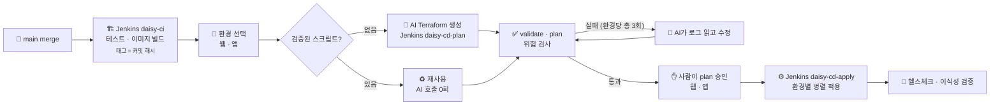
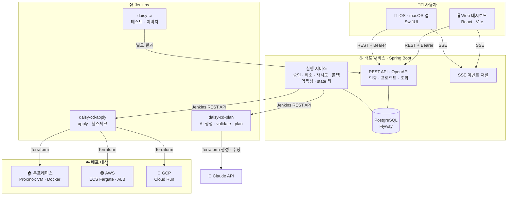

# 🌼 Unibloom

### 한 번 정의하고, 어디서든 피우다
**One Action, Infinite Clouds**

AI 기반 온프레미스 · 퍼블릭 클라우드 원터치 배포 시스템

 

Team Daisy · SoftBank Hackathon 2026 in Korea 예선 (Term 1)

---

> **EN** — Unibloom deploys the same container image to on-premises and public clouds in one action.
> AI writes and fixes the Terraform for each environment, validated scripts are reused without calling the AI again,
> and a human approves every plan before anything is applied.

## 🌱 무엇을 만드나요

배포할 환경만 고르면, **AI가 환경마다 인프라 코드(Terraform)를 만들고 검증해서** 같은 애플리케이션을 **온프레미스와 퍼블릭 클라우드에 동시에** 올려요.

핵심 키워드는 **이식성**이에요. 한 번 빌드한 **같은 이미지**를 모든 환경에 **같은 상태**로 배포하고, 배포가 끝나면 환경마다 이미지 digest를 비교해서 정말 같은지 보여줘요.

<table>
<tr>
<td width="33%" valign="top">

### 🚀 원터치 멀티 배포
온프레미스 · AWS · GCP 중 여러 곳을 한 번에 골라 **병렬로** 배포해요. 환경마다 Terraform state는 따로예요.

</td>
<td width="33%" valign="top">

### 🤖 AI가 쓰고, AI가 고쳐요
Claude가 `deploy.yaml`을 읽고 환경별 Terraform을 만들어요. validate · plan · 위험 검사에 실패하면 **로그를 읽고 스스로 고쳐요** (환경당 총 3회).

</td>
<td width="33%" valign="top">

### ♻️ 검증된 스크립트 재사용
입력 지문(설정 · 기준 모듈 · 규칙)이 같으면 **AI를 부르지 않고** 검증된 스크립트로 이미지 태그만 바꿔요. AI 호출 0회.

</td>
</tr>
<tr>
<td valign="top">

### ✋ 모든 변경은 사람이 승인
plan의 생성 · 변경 · 삭제와 위험 설정을 보여주고, **사람이 승인해야만** 적용해요. 삭제가 있으면 프로젝트 이름까지 입력해요.

</td>
<td valign="top">

### 🧩 한 곳이 실패해도 나머지는 계속
한 환경이 3회 모두 실패해도 다른 환경은 그대로 진행해요. 실패한 환경만 골라 **같은 빌드로 다시 시도**할 수 있어요.

</td>
<td valign="top">

### ⏪ 롤백도 새 배포
이전 성공 커밋과 그때 검증된 스크립트로 **새 배포를 만들고**, 똑같이 plan 승인을 거쳐요. 환경을 골라 되돌릴 수 있어요.

</td>
</tr>
<tr>
<td valign="top">

### ⚡ 실시간 진행
SSE로 단계 · 상태 · 로그가 실시간으로 흘러요. 끊기면 마지막 위치(`Last-Event-ID`)부터 다시 이어 받아요.

</td>
<td valign="top">

### 🔍 이식성 검증
배포가 끝나면 환경별 **이미지 digest · 커밋 · 헬스체크**를 한 표로 비교해요. "같은 이미지가 정말 다 떴는지" 바로 보여요.

</td>
<td valign="top">

### 📱 웹 + 네이티브 앱
웹 대시보드와 **iOS · macOS 앱**이 같은 API로 전체 흐름을 해요. 앱으로 어디서든 승인할 수 있어요.

</td>
</tr>
</table>

## 🔄 배포 흐름

1. **앱 연결 (한 번)** — 사용자 저장소에 `Dockerfile`과 `deploy.yaml`을 둬요. 입력은 GitHub 저장소예요.
2. **이미지 빌드** — `main`에 머지되면 Jenkins `daisy-ci`가 테스트하고 이미지를 만들어요. 태그는 항상 **커밋 해시**예요.
3. **환경 선택** — 웹이나 앱에서 온프레미스 · AWS · GCP 중 여러 곳을 한 번에 골라요. 환경마다 "재사용 / 새로 생성" 판단을 미리 보여줘요.
4. **Terraform 생성** — Jenkins `daisy-cd-plan`에서 Claude가 환경별 Terraform을 만들어요. 검증된 스크립트가 있으면 재사용해요.
5. **검증 · 수정** — `validate → plan → 위험 검사`. 실패하면 AI가 로그를 읽고 고쳐요 (첫 생성 포함 환경당 총 3회).
6. **승인 · 적용** — 사람이 plan을 승인하면 서버가 Jenkins `daisy-cd-apply`를 시작하고, 환경별로 병렬 적용한 뒤 헬스체크를 해요.

## 🏛️ 아키텍처

## 🖥️ 화면

| | 화면 | 하는 일 |
|---|---|---|
| W-01 | 개요 | 환경별 현재 버전 · 헬스, 승인 대기, 이식성 요약 |
| W-02 · W-03 | 저장소 연결 · 이미지 빌드 | GitHub 저장소 연결, Jenkins 빌드 단계 실시간 표시 |
| W-04 | 환경 선택 | 여러 환경을 한 번에, 환경마다 재사용 / 새로 생성 판단 |
| W-05 | 생성 · 검증 | 환경별 진행, "시도 n/3", AI가 고친 Terraform diff |
| W-06 | 승인 | 리소스 변경 · 위험 설정 · AI 비용(추정) 확인 후 승인 |
| W-07 · W-08 | 배포 중 · 결과 | 환경별 병렬 apply 레인, 실시간 로그, 이식성 검증 표 |
| W-09 | 이력 · 롤백 | 버전마다 무엇을 어디에 배포했는지, 환경을 골라 롤백 |
| W-10 ~ W-13 | 환경 · 스크립트 · AI 사용량 · 설정 | 검증된 스크립트 재사용 이력, 배포별 AI 호출 · 토큰 · 비용 |

> 웹과 앱은 **같은 화면 · 같은 문구 · 같은 API**로 전체 흐름을 해요. 앱은 모양만 애플 방식(Liquid Glass)이에요.

## 🧭 설계 원칙

| 원칙 | 내용 |
|---|---|
| 🤖 **AI는 판단이 필요한 곳에만** | AI는 Terraform 생성과 수정만 맡아요. 실행은 검증된 코드와 Terraform이 해요 |
| ✋ **모든 인프라 변경은 사람이 승인** | 승인은 웹 · 앱에서 서버 승인 API 하나로 받아요. AI는 apply하지 않아요 |
| 🧩 **한 환경의 실패가 전체를 멈추지 않음** | 한 환경이 3회 모두 실패해도 나머지 환경은 계속 진행해요 |
| ♻️ **검증된 스크립트 재사용** | 바뀌었는지는 AI가 아니라 **입력 지문 비교**로 판단해요. 같으면 AI 호출 0회 |
| ⏪ **롤백도 새 배포** | 이전 성공 커밋과 그 검증된 스크립트로 새 배포를 만들고, 똑같이 승인을 거쳐요 |
| 🗂️ **환경별 state 분리** | 환경마다 Terraform state와 잠금을 따로 관리해요 |
| 🔁 **두 번 눌러도 한 번** | 배포 · 승인 · 롤백 요청은 `Idempotency-Key`로 한 번만 처리해요 |
| 🙅 **없는 값은 만들지 않음** | 확인하지 못한 토큰 · 비용 · 헬스는 0이 아니라 "—"로 보여줘요 |

## 🔐 신뢰성 · 보안

- **State 락** — 같은 Terraform state를 쓰는 배포는 동시에 돌지 않아요. 응답이 유실돼도 같은 apply를 자동으로 다시 실행하지 않아요.
- **승인한 plan만 적용** — 승인한 plan의 digest를 apply 직전에 다시 확인해요. plan이 낡으면 다시 plan하고 다시 승인받아요.
- **실시간 이벤트 저널** — 모든 단계 · 로그를 순번(`seq`)으로 저장해요. SSE가 끊겨도 마지막 순번부터 이어 받아요.
- **권한** — Bearer 토큰 하나로 REST · SSE를 인증해요. 읽기 전용(viewer) 계정은 조회만 되고, 접근할 수 없는 프로젝트는 존재 여부도 드러내지 않아요(404).
- **비밀값** — 비밀값 · 키 · state 파일은 저장소와 로그에 남기지 않아요. Jenkins 화면도 외부에 공개하지 않아요.

## 🔗 바로가기

| | 링크 |
|---|---|
| 🌐 **웹 대시보드** | [www.unibloom.cloud](https://www.unibloom.cloud) |
| 📡 **API 문서** | [api.unibloom.cloud — Swagger UI](https://api.unibloom.cloud/swagger-ui.html) · [OpenAPI](https://api.unibloom.cloud/v3/api-docs) |
| 🍎 **macOS 앱** | [Unibloom.dmg 다운로드](https://github.com/Softbank-Hackathon-2026-Team-Daisy/unibloom/releases/download/mac-latest/Unibloom.dmg) (Developer ID 서명 · Apple 공증) |
| 📱 **iPhone 앱** | [TestFlight로 설치](https://testflight.apple.com/join/wF5sjQPG) |

## 📦 Repositories

| 레포 | 설명 |
|---|---|
| [**unibloom**](https://github.com/Softbank-Hackathon-2026-Team-Daisy/unibloom) | 배포 시스템 본체 — 웹 대시보드(`web/`) · Swift 앱(`ios/`) · 배포 서비스(`server/`) · 인프라 · AI 생성(`infra/`) |
| [**sample-monolith**](https://github.com/Softbank-Hackathon-2026-Team-Daisy/sample-monolith) | 배포 대상 샘플 앱 HelloCalc — Go 단일 바이너리 모놀리스 |
| [**sample-msa**](https://github.com/Softbank-Hackathon-2026-Team-Daisy/sample-msa) | 배포 대상 샘플 앱 HelloCalc MSA — frontend · backend 서비스 2개 |
| [**.github**](https://github.com/Softbank-Hackathon-2026-Team-Daisy/.github) | 조직 공통 이슈 · PR 템플릿, 이 소개 페이지 |

> 샘플 레포는 "사용자의 앱 저장소"를 흉내 내요. 평가 대상은 앱이 아니라 배포 시스템이라, 앱 동작은 일부러 단순하게 고정했어요.

## 🛠️ Tech Stack

| 영역 | 스택 |
|---|---|
| **Web** | React 19 · Vite · TypeScript · react-router · CSS 변수 디자인 토큰 (라이트 · 다크) · SSE(`fetch` 스트리밍) |
| **App** | SwiftUI 멀티플랫폼 (iOS 18 · macOS 15) · Liquid Glass · TestFlight · 공증된 Mac DMG |
| **Server** | Spring Boot 3.5 · Java 21 · PostgreSQL · Flyway · springdoc OpenAPI · SSE |
| **CI / CD** | Jenkins — `daisy-ci` · `daisy-cd-plan` · `daisy-cd-apply` |
| **IaC** | Terraform (환경별 기준 모듈 + AI 생성) |
| **AI** | Claude API — 구조화 출력으로 Terraform 파일 생성 · 수정 |
| **온프레미스** | Proxmox VM + Docker (Terraform이 컨테이너 관리) · 공인 IP + Route 53 · Let's Encrypt |
| **AWS** | ECS Fargate + ALB (고정 네트워크 위에 앱만 만들고 지워요) |
| **GCP** | Cloud Run |
| **Design** | Figma 와이어프레임 v1.0 · 디자인 시스템 |

## 👥 Team

| | 이름 | GitHub | 역할 |
|---|---|---|---|
| 🧭 | 김도영 | [@kimdoyoung1110](https://github.com/kimdoyoung1110) | 팀장 · Web |
| 📱 | 박승준 | [@Seungjun1127](https://github.com/Seungjun1127) | Swift 앱 (iOS · macOS) · 샘플 앱 |
| ☕ | 하은현 | [@gkdmsgus](https://github.com/gkdmsgus) | Server — 인증 · 인가, 프로젝트 · 대상 환경 · 빌드 이력, 조회 API · OpenAPI |
| ⚙️ | 김승환 | [@7SH7](https://github.com/7SH7) | Server — 배포 실행 규칙(승인 · 취소 · 재시도 · 롤백), Jenkins 연동, 락 · 장애 복구 |
| 🏠 | 황지환 | [@jihwan77](https://github.com/jihwan77) | Infra · 온프레미스 — Proxmox · Docker 모듈, 네트워크 · 접근 제어, 도메인 · HTTPS |
| ☁️ | 임채준 | [@dlacowns21](https://github.com/dlacowns21) | Infra · 클라우드 — AWS · GCP 모듈, Jenkins CI / CD, AI Terraform 생성 |

## 🤝 협업 방식

- **브랜치 보호** — 모든 레포의 `main`은 직접 push 금지, PR + squash merge만 받아요.
- **CODEOWNERS** — `server/`는 server 팀, `infra/`는 infra 팀 승인이 있어야 머지돼요.
- **계약 우선** — API는 서버 OpenAPI가 단일 기준이에요. 새로 필요한 API는 `(가칭)`으로 이슈에 요청하고, 제공 측이 이름과 모양을 정해요.
- **결정 기록** — 팀이 정한 것만 출처 링크와 함께 [`BOARD.md`](https://github.com/Softbank-Hackathon-2026-Team-Daisy/unibloom/blob/main/BOARD.md)에 시간순으로 남겨요. 번복은 지우지 않고 취소선으로 둬요.
- **AI 에이전트 규칙** — 모든 에이전트가 따르는 공통 규칙은 [`AGENTS.md`](https://github.com/Softbank-Hackathon-2026-Team-Daisy/unibloom/blob/main/AGENTS.md), 파트별 규칙은 각 폴더의 `AGENTS.md`에 있어요.
- **작업 기록** — 파트별로 날짜마다 무엇을 하고, 왜 정했고, 어디서 막혔는지 남겨요.
- **이슈 · PR 템플릿** — 작업 · 버그 · 결정 필요 이슈와 PR 템플릿을 이 레포에서 모든 레포에 공통으로 써요.
- **소통** — 문서는 Notion, 대화는 Slack, 예선 전까지 매일 21:00 정기 회의(Slack 허들).

 

**🌼 Unibloom** — *한 번 정의하고, 어디서든 피우다*

Made with 💛 by Team Daisy

